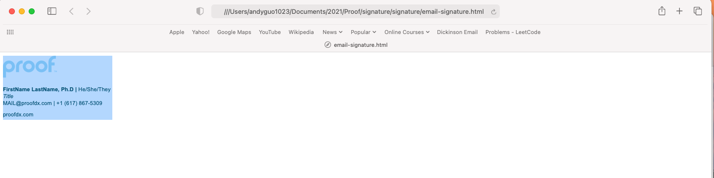
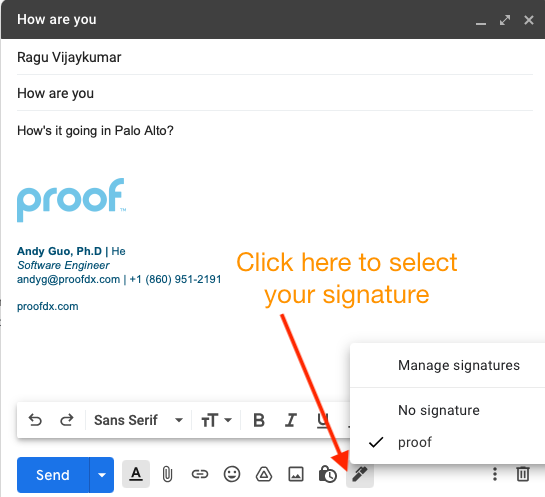

# Setting Up Your Gmail Signature

1. Hold Ctrl (Windows) or Command⌘ (Mac) and click [email-signature.html](https://htmlpreview.github.io/?https://github.com/ProofDx/signature/blob/gh-pages/email-signature.html) to open it within a new tab in your browser.   
    
4. You should see a template like above in your browser. Select everything by using 
    - Windows: Ctrl + A
    - Mac: Command⌘ + A
    
5. With everything selected, as shown above, copy it using Ctrl+C (Windows) or Command⌘+C (Mac). 
6. Go to Gmail Settings, and then find Signature
7. Watch this quick tutorial here. 
	
7. Click Create new. You will be prompted to add a name for this signature. Enter `proof`
8. Once finished, you will see a signature box, paste everything you copied from the template using Ctrl+V (Windows) or Command⌘+V (Mac). 
9. You can now edit the name, title, email address, and phone number to your owm. Use your keyboard arrow keys to get to the section you wish to alter. The styling and formatting should remain the same.
10. Below the editing box, you are presented with 2 options regarding when you would like your signature to appear. Please select your **proof** signature for whichever default options you prefer. The first adds the signature to any new E-Mail created; the latter adds it to any replies to an E-Mail thread.

12. Check the box next to **Insert signature before quoted text in replies and remove the “–” line that precedes it.**
13. Save your changes by scrolling all the way down in the Settings and clicking **Save Changes**.

14. When sending out an email, Gmail lets you select which signature. Select the above signature as default and all your emails will have the same signature. 

